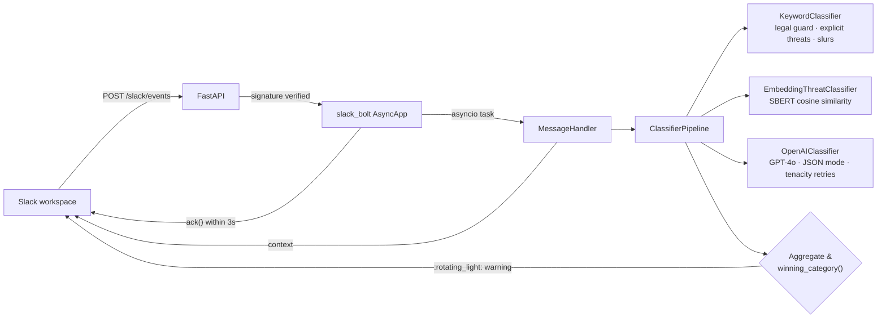

# Slack Content Gateway Safety

[](https://github.com/heidericklucas/slack-content-gateway-safety/actions/workflows/ci.yml)
[](https://www.python.org/)
[](LICENSE)
[](https://github.com/astral-sh/ruff)

A Slack moderation gateway that evaluates messages in near real time and
nudges senders before escalation spreads. It combines three classifiers — a
rule-based keyword filter, sentence-embedding similarity to known threat
patterns, and GPT‑4o — into a composable pipeline with explicit
short-circuit semantics for legitimate legal speech.

> **About this repo.** This is a portfolio project — a real, runnable
> service designed to put a broad set of engineering decisions on display
> in a single, reviewable codebase. Each section below is annotated with
> the *why* behind the choice, not just the *what*.

---

## What this project shows

**Backend Python (production patterns).** FastAPI with an application
factory; `slack_bolt` `AsyncApp` mounted at `/slack/events` so signature
verification runs on the raw bytes; the HTTP handler acks within Slack's
3-second deadline and offloads work to an `asyncio` task with strong
references held in a set to survive GC. `pydantic-settings` with
`SecretStr` fails fast at startup instead of crashing on the first event.
`structlog` provides JSON logs in production and contextvars for
request-scoped fields.

**Architecture & design.** An `AsyncClassifier` Protocol with three
implementations (keyword rules, SBERT cosine similarity, GPT-4o) composed
by a `ClassifierPipeline` with short-circuit semantics. New signals
(e.g. a Perspective API classifier) drop in without touching the handler.
A `CATEGORY_PRIORITY` table makes warning routing explicit and testable.

**AI/LLM integration.** OpenAI Chat Completions in JSON mode, with
`tenacity` exponential-backoff retries on transient API errors,
per-request timeouts, and response clamping. Sentence-transformers
exemplars are pre-baked into the Docker image so cold starts don't pull
the model from HuggingFace at runtime.

**Container & Kubernetes hygiene.** Multi-stage Dockerfile, non-root
UID 1000, read-only rootfs, `HEALTHCHECK`, pre-fetched embedding model.
K8s manifests with startup/readiness/liveness probes, CPU + memory
requests + limits, dropped capabilities, `seccompProfile: RuntimeDefault`,
`automountServiceAccountToken: false`, rolling update with
`maxUnavailable: 0`, kustomization, and Bitnami sealed secrets.

**Testing discipline.** 46 pytest tests, fully mocked (no network),
sub-second runtime. Coverage of: legal-justification guard, word
boundaries, pipeline short-circuiting, classifier exception resilience,
LLM response parsing edge cases (malformed JSON, markdown fences,
unknown categories, out-of-range scores), priority routing,
Slack-history failure paths, and FastAPI probes via `httpx`'s
`ASGITransport`.

**CI/CD & dev experience.** GitHub Actions runs `ruff check`,
`ruff format --check`, `mypy --strict`, the pytest matrix on Python 3.11
and 3.12, and a Docker buildx smoke build. Dependabot batches runtime,
dev, GitHub-actions, and Dockerfile updates. `pyproject.toml` centralises
ruff, mypy, pytest, and coverage configuration.

**Security awareness.** Real threat-modelling table in the
[Security model](#security-model) section — forged events, replays,
retry storms, long-running handlers, container compromise, secret
leakage, dependency drift, each paired with a concrete mitigation.

---

## How it works



* **Signature verification** is enforced on the raw request bytes by
  `slack_bolt`, before the body is parsed.
* **Acks within 3 seconds.** The HTTP handler returns immediately and the
  expensive work runs in a background `asyncio` task.
* **Legal-speech short-circuit.** If a message asserts a legal right
  (privacy, attorney-general complaints, etc.), the pipeline stops and no
  warning is posted — users invoking their rights aren't moderated.
* **Pluggable classifiers.** Each classifier implements `AsyncClassifier`
  and emits `Signal` objects. New signals (e.g. perspective-api, custom
  rules) can be added without touching the handler.
* **Priority-based routing.** When multiple categories trigger, the most
  severe one wins via `CATEGORY_PRIORITY`.

## Configuration

All settings come from environment variables (see [`.env.example`](.env.example)).
Required:

| Variable                | Description                                             |
| ----------------------- | ------------------------------------------------------- |
| `SLACK_SIGNING_SECRET`  | HMAC signing secret from the Slack app's *Basic info*   |
| `SLACK_BOT_TOKEN`       | `xoxb-…` token with `chat:write`, `channels:history`    |
| `OPENAI_API_KEY`        | OpenAI key with access to `gpt-4o`                      |

Optional (defaults shown):

| Variable                          | Default                                                  | Description                                       |
| --------------------------------- | -------------------------------------------------------- | ------------------------------------------------- |
| `OPENAI_MODEL`                    | `gpt-4o`                                                 | OpenAI model id                                   |
| `OPENAI_TIMEOUT_SECONDS`          | `15`                                                     | Per-request timeout                               |
| `EMBEDDING_ENABLED`               | `true`                                                   | Toggle SBERT classifier                           |
| `EMBEDDING_MODEL`                 | `sentence-transformers/paraphrase-MiniLM-L6-v2`          | HuggingFace model id                              |
| `LOG_LEVEL` / `LOG_FORMAT`        | `INFO` / `json`                                          | Structlog level + renderer (`json` or `console`)  |
| `CONTEXT_MESSAGE_LIMIT`           | `20`                                                     | Slack history fetched for context                 |
| `MAX_RETRY_ATTEMPTS`              | `2`                                                      | Honour Slack's `X-Slack-Retry-Num`                |
| `THRESHOLD_*`                     | see [`app/config.py`](app/config.py)                     | Per-category score thresholds                     |

## Running locally

```bash
python3.12 -m venv .venv
source .venv/bin/activate
pip install -e ".[dev]"
cp .env.example .env  # then fill in real values

# Run the API
python -m app.main
# → http://localhost:5000  (docs at /docs)
```

Or in Docker:

```bash
docker build -t slack-content-gateway:dev .
docker run --rm -p 5000:5000 --env-file .env slack-content-gateway:dev
```

Expose to Slack via a tunnel (e.g. `ngrok http 5000`) and set the **Events API**
request URL to `https://<tunnel>/slack/events`.

## Testing

```bash
pytest                           # full suite, no network
pytest --cov=app                 # with coverage
ruff check . && ruff format --check .
mypy app
```

The 46-test suite runs in well under a second by mocking the OpenAI and
Slack clients. The embedding classifier is disabled in CI to avoid
pulling in torch — see [`.github/workflows/ci.yml`](.github/workflows/ci.yml).

## Kubernetes deployment

The manifests in [`k8s/`](k8s) ship with hardened defaults:

* `runAsNonRoot`, `readOnlyRootFilesystem`, `drop: [ALL]` capabilities
* CPU/memory requests + limits
* Startup, readiness, and liveness probes against `/readyz` and `/healthz`
* Non-secret config in a `ConfigMap`, secrets sealed via Bitnami
  [Sealed Secrets](https://github.com/bitnami-labs/sealed-secrets)

Reseal secrets with your credentials and apply:

```bash
kubectl create secret generic slack-secret --dry-run=client \
  --from-literal=SLACK_SIGNING_SECRET='…' \
  --from-literal=SLACK_BOT_TOKEN='xoxb-…' \
  -o yaml | kubeseal --format yaml > k8s/slack-secret-sealed.yaml

kubectl create secret generic openai-secret --dry-run=client \
  --from-literal=OPENAI_API_KEY='sk-…' \
  -o yaml | kubeseal --format yaml > k8s/openai-secret-sealed.yaml

kubectl apply -k k8s/
```

On Minikube:

```bash
minikube start
minikube image build -t lucashvieira/slack-content-gateway:0.2.0 .
kubectl apply -k k8s/
kubectl patch svc slack-content-gateway -p '{"spec":{"type":"NodePort"}}'
minikube service slack-content-gateway
```

## Security model

| Threat                                | Mitigation                                                                 |
| ------------------------------------- | -------------------------------------------------------------------------- |
| Forged Slack events                   | `slack_bolt` HMAC verification on the raw request bytes                    |
| Replay attacks                        | Slack's `X-Slack-Request-Timestamp` window enforced by `slack_bolt`        |
| Slack retry storms                    | `X-Slack-Retry-Num` honoured; over-limit retries dropped                   |
| Long-running handlers > 3 s timeout   | HTTP ack happens immediately; classification is a background `asyncio` task |
| Container compromise                  | Non-root UID 1000, read-only rootfs, all caps dropped, seccomp `RuntimeDefault` |
| Secret leakage in logs                | `SecretStr` from Pydantic — secrets never str()-render                     |
| Dependency drift                      | Pinned ranges + Dependabot weekly PRs                                      |

## Project layout

```
app/
├── classifier/         # AsyncClassifier protocol + 3 implementations
│   ├── base.py
│   ├── keyword.py      #   rule-based: legal guard, threats, slurs
│   ├── embeddings.py   #   SBERT cosine similarity to threat exemplars
│   ├── llm.py          #   OpenAI GPT-4o, tenacity retries, JSON mode
│   └── pipeline.py     #   short-circuit composition
├── slack/
│   ├── bolt_app.py     # slack_bolt AsyncApp, sig verify, retry guard
│   ├── handlers.py     # MessageHandler — fetch context → classify → warn
│   └── warnings.py     # warning templates
├── config.py           # Pydantic Settings with SecretStr
├── logging_config.py   # structlog (JSON in prod, pretty locally)
├── schemas.py          # Verdict, Signal, Category, priority table
└── main.py             # FastAPI factory; /healthz, /readyz, /slack/events
tests/                  # 46 tests — fully mocked
k8s/                    # Deployment, Service, ConfigMap, kustomization, sealed secrets
```

## License

[MIT](LICENSE)
