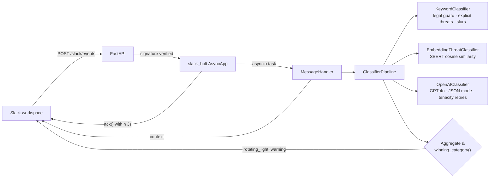

# Slack Content Gateway Safety

[](https://github.com/heidericklucas/slack-content-gateway-safety/actions/workflows/ci.yml)
[](https://www.python.org/)
[](https://hub.docker.com/r/lucashvieira/slack-content-gateway)
[](LICENSE)
[](https://github.com/astral-sh/ruff)

A Slack-side moderation gateway. Every message in a watched channel is evaluated
in near real time by a three-stage classifier pipeline — deterministic rules,
semantic embeddings, and GPT-4o — and the sender gets a private in-channel nudge
before a situation escalates. Messages that read as legal speech (filing a
complaint, asserting privacy rights) short-circuit out of the pipeline so people
invoking their rights are never moderated.

> **About this repo.** This is a portfolio project. It's a real, runnable
> service built to demonstrate, in a single reviewable codebase, how I design
> production backend systems end to end — typed async Python, pluggable
> architecture, hardened containers, Kubernetes, observability, testing,
> CI/CD, and a documented security model. Each section below is annotated
> with the *why* behind the choice, not just the *what*.

---

## Why this exists

Workplace chat is overwhelmingly fine, but the rare bad message — a thinly
veiled dismissal threat from a manager, a slur, sustained micromanagement —
does real damage and is hard for a human moderator to catch in time. The cost
of false positives is also real: nobody wants their HR system pinging because
someone wrote "we should fire up the new dashboard" in a meeting recap.

Two design constraints fall out of that:

* **Cheap signals run first.** A regex doesn't need a network round-trip.
  Most messages are obviously fine, so spending two seconds and a GPT-4o
  request to confirm "ship date moved to Friday" is benign would be wasteful.
  Putting the cheapest classifiers at the front of the pipeline keeps the
  median latency low and the OpenAI bill bounded.
* **Don't moderate legal speech.** If someone explicitly invokes a labour-law
  right or names a formal complaint, the system gets out of the way. This is
  implemented as an explicit `skip_remaining` short-circuit at the rule stage —
  not a vague prompt instruction — so it's testable, deterministic, and visible
  in the logs.

## What happens when a message arrives

1. **`slack_bolt` verifies the request signature** on the raw request bytes
   (HMAC-SHA256 over body + timestamp, replay window enforced) and acks within
   Slack's 3-second deadline.
2. The HTTP handler schedules the actual classification work as a **background
   `asyncio` task**, with strong references held in a `set` so tasks survive
   Python's GC.
3. The `MessageHandler` fetches up to 20 messages of channel context
   (rate-limit tolerant — a 429 from Slack downgrades to no-context rather than
   blocking) and feeds them to the pipeline.
4. The pipeline composes three classifiers, each implementing a common
   `AsyncClassifier` protocol:
   * **`KeywordClassifier`** — sub-millisecond regex over a curated list of
     legal-speech phrases, dismissal-threat patterns, and slurs in pt-BR and
     en. A legal-speech match flips `skip_remaining` and the pipeline aborts.
   * **`EmbeddingThreatClassifier`** — sentence-transformers cosine similarity
     against a hand-built corpus of threat exemplars. Catches paraphrased
     threats that don't match the keyword list.
   * **`OpenAIClassifier`** — GPT-4o in JSON-mode, with `tenacity`
     exponential-backoff retries, per-request timeouts, response-format
     enforcement, and score clamping into `[0, 1]`. Returns continuous scores
     across five categories: aggression, harassment, threat,
     coercive_authority, condescension.
5. Scores are aggregated into a single `Verdict`. If any category crosses its
   configured threshold, the most severe one wins via an explicit
   `CATEGORY_PRIORITY` table, and a templated `:warning:` (or `:rotating_light:`
   for threats) is posted back to the channel — mentioning the offender by
   `@user` but never quoting the offending text.

## Verified end-to-end against a real workspace

Four canonical cases, posted live to a Slack channel, with measurements:

| Message | Expected | Result | Latency | Path |
| --- | --- | --- | --- | --- |
| "Ship date moved to Friday." | no warning | `no_warning` | 3.0 s | Full OpenAI roundtrip, all categories below threshold |
| "Don't be such an idiot about this." | abusive language | `:warning:` posted | 1.6 s | Keyword `1.0` + OpenAI signals; keyword's certainty wins |
| "You'll be fired by Monday." | threat | `:rotating_light:` posted | 2.5 s | English phrasing not in keyword list — **OpenAI alone caught the threat** |
| "I'm going to file a formal complaint with the attorney general." | skip everything | no warning | **0.12 s** | Pipeline short-circuited after the rule stage — OpenAI never called |

That last row is the architecture paying its rent: the legal-speech
short-circuit avoids the LLM call entirely, saving both latency and credits,
and protects the user invoking their rights from being moderated at all.

## Architecture



Non-obvious decisions:

* **FastAPI + `slack_bolt` mounted as a sub-handler.** `slack_bolt` carries
  signature verification, the URL-verification challenge handshake, and
  retry-tracking via `X-Slack-Retry-Num`. FastAPI gives me typed dependency
  injection, `/healthz` and `/readyz` for Kubernetes probes, and an OpenAPI
  schema for free.
* **Background `asyncio` tasks over a queue + worker.** A real queue would be
  correct at scale, but the request volume here (a workspace, not the public
  internet) doesn't justify the operational surface. Per-message tasks keep
  the system trivially small.
* **`AsyncClassifier` protocol.** Every signal source is the same interface,
  composed by `ClassifierPipeline`. Plugging in a Perspective API classifier
  or a custom local model is a single new file — no changes to the request
  handler.
* **`CATEGORY_PRIORITY` as a tuple, not a function.** When multiple categories
  trigger on one message, the most severe one wins. Encoding that as data
  instead of conditional logic makes the routing explicit, exhaustive, and
  unit-testable.
* **Embedding classifier is opt-in (`EMBEDDING_ENABLED=true`).** The full
  SBERT path adds ~80 MB of model files and ~10 s of cold-start time to
  download them. Tests run with embeddings disabled for speed; production
  enables them.

## Production patterns

* **`pydantic-settings` with `SecretStr`** — configuration is validated at
  process start and missing credentials fail fast with a clear message,
  instead of crashing on the first Slack event hours later. `SecretStr`
  refuses to `str()`-render into logs or error messages.
* **`structlog`** — JSON renderer in production, coloured console renderer
  locally (`LOG_FORMAT=console`). Per-request fields (`slack_user`,
  `slack_channel`, `slack_ts`) are propagated via `contextvars`, so every
  log line emitted during one message's lifecycle carries the same trace
  context.
* **`mypy --strict`** clean over the entire `app` package, enforced in CI.
* **`tenacity`** for OpenAI retries with random-exponential backoff,
  bounded by `max_retries=3` and a per-attempt `timeout` budget — so a slow
  Slack event can't pile up on top of itself indefinitely.
* **46 pytest tests, fully mocked, sub-second runtime.** Coverage spans the
  legal-justification guard (with `\b` word boundaries to avoid sub-word
  matches), pipeline short-circuit semantics, classifier exception
  resilience (a single broken classifier doesn't take down the pipeline),
  LLM response parsing (malformed JSON, stray markdown fences, unknown
  categories, out-of-range scores), priority routing, Slack-history failure
  paths, and FastAPI probes via `httpx`'s `ASGITransport`.

## Container & Kubernetes

* **Multi-stage Dockerfile.** The builder stage installs CPU-only PyTorch
  from the dedicated index — that single line drops ~1.5 GB of NVIDIA CUDA,
  cuDNN, NCCL, cuSPARSELt, and Triton wheels that this CPU-only inference
  workload would never use. It also pre-downloads the SBERT model into
  `/opt/hf-cache` so cold starts don't reach HuggingFace.
* **Final image: 489 MB compressed for `linux/amd64`** (9 layers). Builder
  artefacts and the toolchain are discarded in the runtime stage.
* **Hardening.** `runAsNonRoot: true` (UID 1000), `readOnlyRootFilesystem:
  true` (with `emptyDir` mounts for `/tmp` and the HF cache),
  `allowPrivilegeEscalation: false`, all Linux capabilities dropped,
  `seccompProfile: RuntimeDefault`, `automountServiceAccountToken: false`.
* **Probes.** A `startupProbe` against `/readyz` gives the pod up to 150 s to
  warm up the embedding model on first boot; `readinessProbe` and
  `livenessProbe` then take over against `/readyz` and `/healthz`.
* **Rollouts.** `RollingUpdate` strategy with `maxUnavailable: 0`, two
  replicas by default, `revisionHistoryLimit: 3`.
* **Secrets & config.** Non-secret configuration lives in a `ConfigMap`;
  Slack and OpenAI credentials live in Bitnami Sealed Secrets so the
  encrypted blobs can safely live in this repo. Everything wires together
  through a `kustomization.yaml`.

## CI/CD

GitHub Actions runs on every PR and every push to `main`:

* `ruff check` and `ruff format --check` — lint + formatter clean
* `mypy --strict` over `app/`
* `pytest` matrix on Python **3.11** and **3.12**, with coverage upload
* Docker buildx smoke build (no push)

Dependabot batches updates by category — runtime, dev, GH Actions,
Dockerfile — on a weekly cadence, so single-line bumps don't drown out the
signal.

## Security model

| Threat | Mitigation |
| --- | --- |
| Forged Slack events | `slack_bolt` HMAC verification on the raw request bytes, before parsing |
| Replay attacks | `X-Slack-Request-Timestamp` window enforced by `slack_bolt` |
| Retry storms | `X-Slack-Retry-Num` honoured; retries above `MAX_RETRY_ATTEMPTS` are dropped |
| Handlers exceeding the 3 s ack deadline | HTTP returns immediately; classification runs in a background `asyncio` task |
| Container compromise | Non-root UID 1000, read-only rootfs, all caps dropped, seccomp `RuntimeDefault` |
| Secret leakage in logs | `SecretStr` from Pydantic — secrets never `str()`-render |
| Long-tail dependency drift | Pinned ranges + Dependabot weekly PRs grouped by category |

## Configuration

All settings are read from environment variables, validated by
`pydantic-settings`. See [`.env.example`](.env.example) for a complete list.

**Required:**

| Variable | Description |
| --- | --- |
| `SLACK_SIGNING_SECRET` | HMAC signing secret from the Slack app's *Basic information* page |
| `SLACK_BOT_TOKEN` | `xoxb-…` token with `chat:write` and `channels:history` scopes |
| `OPENAI_API_KEY` | OpenAI key with access to `gpt-4o` |

**Optional (defaults shown):**

| Variable | Default | Description |
| --- | --- | --- |
| `OPENAI_MODEL` | `gpt-4o` | OpenAI model name |
| `OPENAI_TIMEOUT_SECONDS` | `15` | Per-request timeout |
| `EMBEDDING_ENABLED` | `true` | Toggle the SBERT classifier |
| `EMBEDDING_MODEL` | `sentence-transformers/paraphrase-MiniLM-L6-v2` | HuggingFace model id |
| `LOG_LEVEL` / `LOG_FORMAT` | `INFO` / `json` | structlog level + renderer (`json` or `console`) |
| `CONTEXT_MESSAGE_LIMIT` | `20` | Slack history depth fetched for context |
| `MAX_RETRY_ATTEMPTS` | `2` | Upper bound on Slack's retry header |
| `THRESHOLD_*` | see [`app/config.py`](app/config.py) | Per-category score thresholds |

## Running it locally

```bash
python3.12 -m venv .venv
source .venv/bin/activate
pip install -e ".[dev]"
cp .env.example .env  # fill in real values

python -m app.main
# → http://localhost:5000  (interactive OpenAPI at /docs)
```

Or, in Docker:

```bash
docker run --rm -p 5000:5000 --env-file .env \
  lucashvieira/slack-content-gateway:0.2.0
```

To expose the local server to Slack for development, use any HTTP tunnel
(`ngrok http 5000`, `cloudflared tunnel`, etc.) and paste the resulting URL
into the Slack app's **Event Subscriptions** → **Request URL** as
`https://<tunnel>/slack/events`.

## Tests, lint, types

```bash
pytest                         # full suite, no network, sub-second
pytest --cov=app               # with coverage
ruff check . && ruff format --check .
mypy app
```

The default test run sets `EMBEDDING_ENABLED=false` to skip the SBERT
warm-up — every other path is exercised against `AsyncMock` stand-ins for
the OpenAI and Slack clients.

## Kubernetes deployment

```bash
# 1. Seal your credentials so they can live in the repo
kubectl create secret generic slack-secret --dry-run=client \
  --from-literal=SLACK_SIGNING_SECRET='…' \
  --from-literal=SLACK_BOT_TOKEN='xoxb-…' \
  -o yaml | kubeseal --format yaml > k8s/slack-secret-sealed.yaml

kubectl create secret generic openai-secret --dry-run=client \
  --from-literal=OPENAI_API_KEY='sk-…' \
  -o yaml | kubeseal --format yaml > k8s/openai-secret-sealed.yaml

# 2. Apply everything
kubectl apply -k k8s/
```

The image referenced by `k8s/deployment.yaml`
(`lucashvieira/slack-content-gateway:0.2.0`) is published on Docker Hub.

For Minikube on Apple Silicon you'll want to build a local arm64 image
first, since the published one is amd64-only:

```bash
minikube image build -t lucashvieira/slack-content-gateway:0.2.0 .
kubectl apply -k k8s/
kubectl patch svc slack-content-gateway -p '{"spec":{"type":"NodePort"}}'
minikube service slack-content-gateway
```

## Project layout

```
app/
├── classifier/
│   ├── base.py           AsyncClassifier Protocol
│   ├── keyword.py        Rule-based: legal guard, explicit threats, slurs
│   ├── embeddings.py     SBERT cosine similarity against threat exemplars
│   ├── llm.py            OpenAI GPT-4o, JSON-mode, tenacity retries
│   └── pipeline.py       Composition with skip-remaining semantics
├── slack/
│   ├── bolt_app.py       slack_bolt AsyncApp, signature verify, retry guard
│   ├── handlers.py       MessageHandler — context → classify → warn
│   └── warnings.py       Warning templates per category
├── config.py             Pydantic Settings with SecretStr
├── logging_config.py     structlog (JSON in prod, pretty locally)
├── schemas.py            Verdict, Signal, Category, priority table
└── main.py               FastAPI factory; /healthz, /readyz, /slack/events
tests/                    46 tests, fully mocked
k8s/                      Deployment, Service, ConfigMap, kustomization, sealed secrets
.github/workflows/ci.yml  Lint, types, tests, Docker build
```

## License

[MIT](LICENSE)
